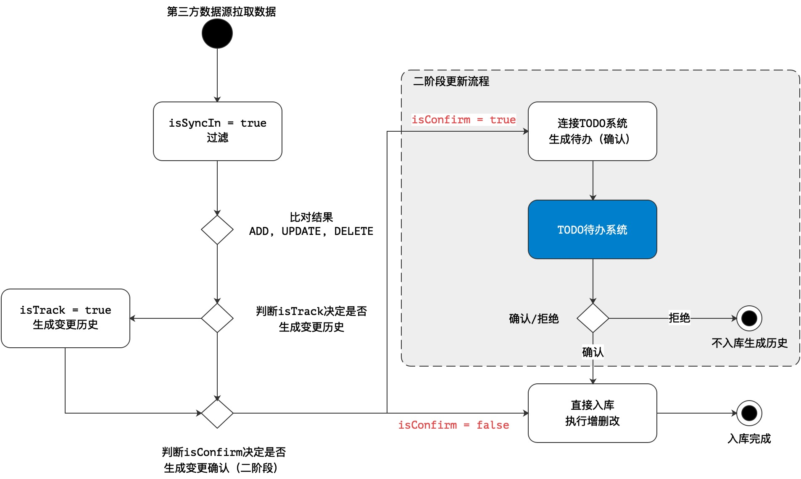
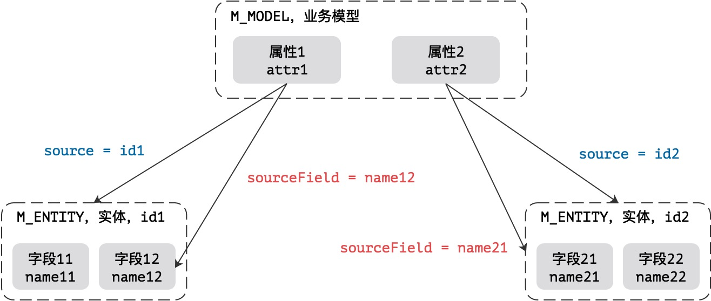

# Attribute设计详解

## 1. 关于属性类型

&ensp;&ensp;&ensp;&ensp;模型中的属性主要分三种类型，不同类型的数据源会有所区别，主要由`type`属性定义，而`isArray`属性用于定义该属性是单属性还是集合属性，整体会形成如下二维表。

| type | isArray | 含义 |
| :--- | :--- | :--- |
| INTERNAL | false | 标准属性中的单属性（常用）|
| INTERNAL | true | 标准属性中的集合属性（静态存储）|
| REFERENCE | false | 引用属性的连接属性，一对一（One To One）|
| REFERENCE | true | 引用属性的集合属性，一堆多（One To Many）|
| EXTERNAL | false | **保留**：外联属性中的单属性 |
| EXTERNAL | true | **保留**：外联属性中的集合属性 |

## 2. 配置数据

&ensp;&ensp;&ensp;&ensp;除开上述的`type`和`isArray`之外，属性定义中的核心配置数据如下。

### 2.1. 类型相关

| 配置名 | 默认值 | 含义 |
| :--- | :--- | :--- |
| source | 无 | 关联的底层 M_ENTITY 表的 identifier |
| sourceField | 无 | 关联的底层 M_FIELD 表的 name 属性 |
| sourceDepend | 无 | 引用属性/外联属性中，依赖字段信息，直接拷贝数据 |
| sourceConfig | 无 | 标准属性专用配置，集合配置才会用到 |
| sourceReference | 无 | 引用属性专用配置 |
| sourceExternal | 无 | 外联属性专用配置 |

### 2.2. 标记相关

| 配置名 | 默认值 | 含义 |
| :--- | :--- | :--- |
| isArray | false | 当前属性是否集合属性，集合属性会启用JsonArray序列化 |
| isLock | false | 是否锁定，如果锁定，该属性不可在建模管理中删除 |
| isTrack | true | 是否监控，如果监控，则该属性会在启用历史记录时生成变更历史 |
| isConfirm | true | 变更确认，如果启用变更确认，该属性会进入确认/更新的双阶段更新流程 |
| isSyncIn | true | 同步读，和第三方集成时是否读取第三方数据 |
| isSyncOut | true | 同步写，和第三方集成时是否推送该属性到第三方数据源 |

### 2.3. 插件相关

| 配置名 | 默认值 | 含义 |
| :--- | :--- | :--- |
| inComponent | NULL | 往数据库中写数据时的插件，Before流程 |
| normalize | NULL | 表达式，inComponent的简化版 |
| outComponent | NULL | 从数据库中读取数据时的插件，After流程 |
| expression | NULL | 表达式，outComponent的简化版 |

## 3. 复杂场景分析

&ensp;&ensp;&ensp;&ensp;属性的适配场景分为如下：

* 基本的CRUD以及目前提供的标准化14接口操作。
* 导入/导出的分流处理，单属性和集合属性需要执行不同的文件模板流程。
* 变更历史，属性是否记录变更历史，使用`isTrack`判断。
* 变更确认，属性是否开启二阶段更新，使用`isConfirm`判断。
* 集合属性的使用场景，`isArray, sourceX`。

### 3.1. 变更

&ensp;&ensp;&ensp;&ensp;整个系统的变更流程参考如下：



&ensp;&ensp;&ensp;&ensp;该场景仅适用于从第三方主动拉取数据，通常定义为后台任务（Job），影响流程的三个标记为：

* `isTrack`：是否开启变更历史，生成历史记录，对应`X_ACTIVITY, X_ACTIVITY_CHANGE`。
* `isConfirm`：是否开启二阶段更新流程，生成变更确认，对应`X_TODO`。
* `isSyncIn`：可接受字段的过滤，如果没有存在于该字段中的数据不同步。

&ensp;&ensp;&ensp;&ensp;二阶段更新流程一旦开启，必须走另外的一个流程（这里的待办系统）来实现最终的数据入库流程，变更历史`X_ACTIVITY、X_ACTIVITY_CHANGE`两张表上的`active`标记用于表示当前历史是真实发生过的历史、或虚拟历史（虚拟历史如被拒绝的变更历史，不合法的变更历史，这种变更历史不出现在变更记录查询中）。

### 3.2. 标准CRUD

```shell
type = INTERNAL, isArray = false
```

&ensp;&ensp;&ensp;&ensp;标准的CRUD流程即执行了JtComponent的标准流程，该流程主要处理核心单属性，这种场景中只启用`source`和`sourceField`两个附加配置来定义，它的属性表如下：

| 配置名 | 含义 |
| :--- | :--- |
| source | 关联的底层 M_ENTITY 表的 identifier |
| sourceField | 关联的底层 M_FIELD 表的 name 属性 |

&ensp;&ensp;&ensp;&ensp;这里关联的底层 M_ENTITY 表的 identifier 必须出现在`M_JOIN`的定义中，表示当前属性来自于底层的实体模型，如果模型是 type = JOINED 的连接模型，则该字段可出现多个值。



&ensp;&ensp;&ensp;&ensp;上图是一个Model对应两个Entity的结构，而之中存储的`M_ATTRIBUTE`如下：

| 属性名 | source | sourceField |
| :--- | :--- | :--- |
| attr1 | id1 | name12 |
| attr2 | id2 | name21 |

> 如果只关联到一个Entity实体，则 source 字段的值在同一个模型中是唯一的。

### 3.3. 标准集合属性

```shell
type = INTERNAL, isArray = true
```

### 3.4. 引用单记录

#### 3.4.1. 主引用属性

#### 3.4.2. 辅助引用属性

### 3.5. 引用多记录