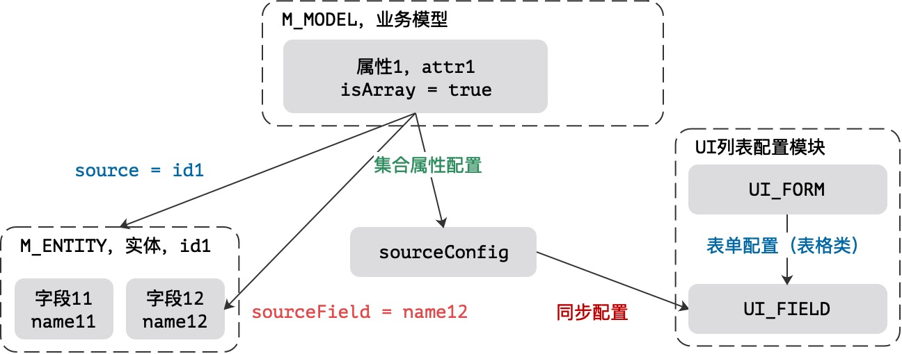
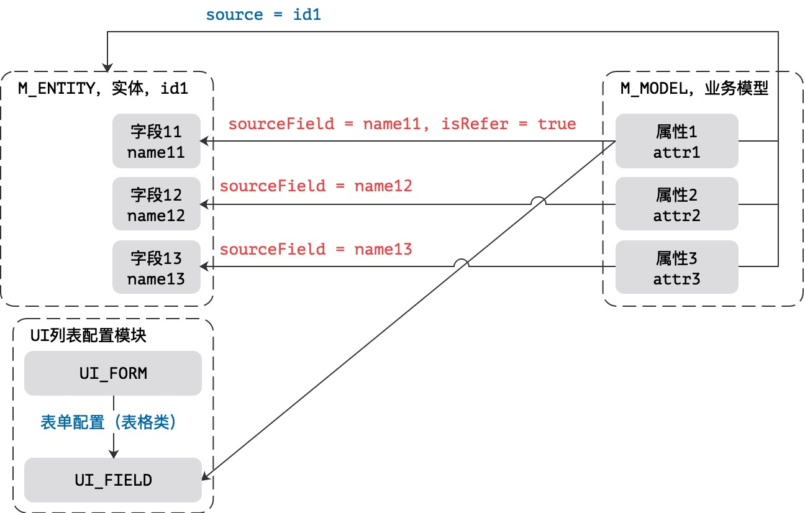
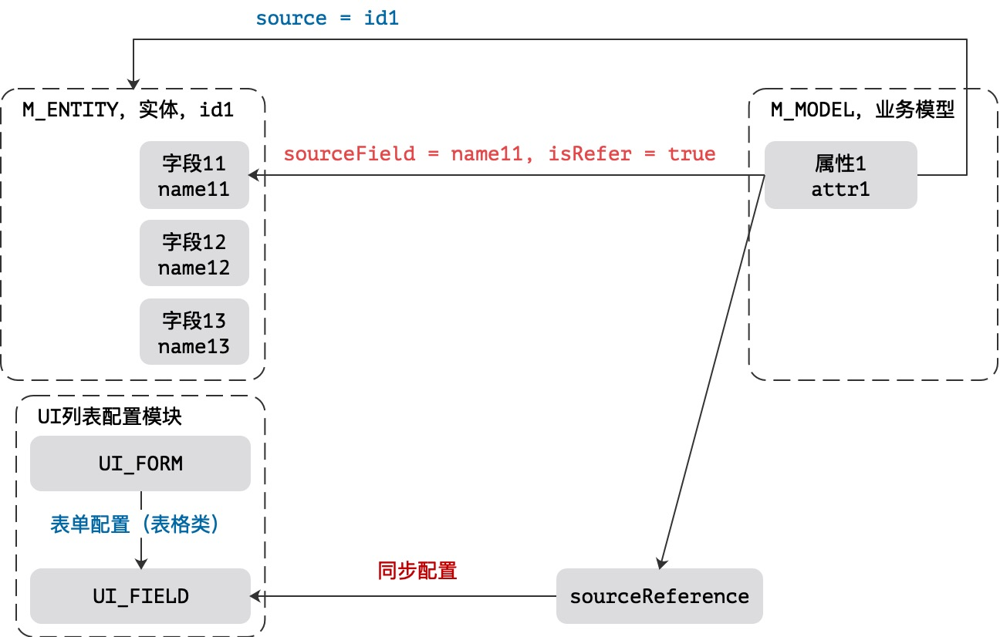

# Attribute设计详解

## 1. 关于属性类型

&ensp;&ensp;&ensp;&ensp;模型中的属性主要分三种类型，不同类型的数据源会有所区别，主要由`type`属性定义，而`isArray`属性用于定义该属性是单属性还是集合属性，整体会形成如下二维表。

| type | isArray | 含义 |
| :--- | :--- | :--- |
| INTERNAL | false | 标准属性中的单属性（常用）|
| INTERNAL | true | 标准属性中的集合属性（静态存储）|
| REFERENCE | false | 引用属性的连接属性，一对一（One To One）|
| REFERENCE | true | 引用属性的集合属性，一堆多（One To Many）|
| EXTERNAL | false | **保留**：外联属性中的单属性 |
| EXTERNAL | true | **保留**：外联属性中的集合属性 |

> EXTERNAL类型的属性表示模型中属性的数据源来自于非Ox的业务数据库，后期开通集成直接调用接口时采用该属性完成外置属性的关联任务。

## 2. 配置数据

&ensp;&ensp;&ensp;&ensp;除开上述的`type`和`isArray`之外，属性定义中的核心配置数据如下。

### 2.1. 类型相关

| 配置名 | 默认值 | 含义 |
| :--- | :--- | :--- |
| source | 无 | 关联的底层 M_ENTITY 表的 identifier |
| sourceField | 无 | 关联的底层 M_FIELD 表的 name 属性 |
| sourceConfig | 无 | type = INTERNAL, 标准属性专用配置，集合配置才会用到 |
| sourceReference | 无 | type = REFERENCE, 引用属性专用配置 |
| sourceExternal | 无 | type = EXTERNAL, 外联属性专用配置 |

### 2.2. 标记相关

| 配置名 | 默认值 | 含义 |
| :--- | :--- | :--- |
| isArray | false | 当前属性是否集合属性，集合属性会启用JsonArray序列化 |
| isRefer | false | 当前属性是 type = REFERENCE 中的主属性 |
| isLock | false | 是否锁定，如果锁定，该属性不可在建模管理中删除 |
| isTrack | true | 是否监控，如果监控，则该属性会在启用历史记录时生成变更历史 |
| isConfirm | true | 变更确认，如果启用变更确认，该属性会进入确认/更新的双阶段更新流程 |
| isSyncIn | true | 同步读，和第三方集成时是否读取第三方数据 |
| isSyncOut | true | 同步写，和第三方集成时是否推送该属性到第三方数据源 |

### 2.3. 插件相关

| 配置名 | 默认值 | 含义 |
| :--- | :--- | :--- |
| inComponent | NULL | 往数据库中写数据时的插件，Before流程 |
| normalize | NULL | 表达式，inComponent的简化版 |
| outComponent | NULL | 从数据库中读取数据时的插件，After流程 |
| expression | NULL | 表达式，outComponent的简化版 |

## 3. 复杂场景分析

&ensp;&ensp;&ensp;&ensp;属性的适配场景分为如下：

* 基本的CRUD以及目前提供的标准化接口（14个）操作。
* 导入/导出的分流处理，单属性和集合属性需要执行不同的文件模板流程。
* 变更历史，属性是否记录变更历史，使用`isTrack`判断。
* 变更确认，属性是否开启二阶段更新，使用`isConfirm`判断。
* 集合属性的使用场景，`isArray, sourceX`。

### 3.1. 变更

&ensp;&ensp;&ensp;&ensp;整个系统的变更流程参考如下：


&ensp;&ensp;&ensp;&ensp;该场景仅适用于从第三方主动拉取数据，通常定义为后台任务（Job），影响流程的三个标记为：

* `isTrack`：是否开启变更历史，生成历史记录，对应`X_ACTIVITY, X_ACTIVITY_CHANGE`。
* `isConfirm`：是否开启二阶段更新流程，生成变更确认，对应`X_TODO`。
* `isSyncIn`：可接受字段的过滤，如果没有存在于该字段中的数据不同步。

&ensp;&ensp;&ensp;&ensp;二阶段更新流程一旦开启，必须走另外的一个流程（这里的待办系统）来实现最终的数据入库流程，变更历史`X_ACTIVITY、X_ACTIVITY_CHANGE`两张表上的`active`标记用于表示当前历史是真实发生过的历史、或虚拟历史（虚拟历史如被拒绝的变更历史，不合法的变更历史，这种变更历史不出现在变更记录查询中）。

### 3.2. 标准CRUD

```shell
type = INTERNAL, isArray = false
```

&ensp;&ensp;&ensp;&ensp;标准的CRUD流程即执行了JtComponent的标准流程，该流程主要处理核心单属性，这种场景中只启用`source`和`sourceField`两个附加配置来定义，它的属性表如下：

| 配置名 | 含义 |
| :--- | :--- |
| source | 关联的底层 M_ENTITY 表的 identifier |
| sourceField | 关联的底层 M_FIELD 表的 name 属性 |

&ensp;&ensp;&ensp;&ensp;这里关联的底层 M_ENTITY 表的 identifier 必须出现在`M_JOIN`的定义中，表示当前属性来自于底层的实体模型，如果模型是 type = JOINED 的连接模型，则该字段可出现多个值。


&ensp;&ensp;&ensp;&ensp;上图是一个Model对应两个Entity的结构，而之中存储的`M_ATTRIBUTE`如下：

| 属性名 | source | sourceField |
| :--- | :--- | :--- |
| attr1 | id1 | name12 |
| attr2 | id2 | name21 |

&ensp;&ensp;&ensp;&ensp;从图上可以知道，该模型的类型必须是`JOINED`（它的属性来自于两个不同的实体），而属性`attr1`来自于实体`id1`中，属性`attr2`来自于实体`id2`中，模型本身在定义层实现了跨表处理（底层实体一个实体对应一个实体表）。

> 如果只关联到一个Entity实体，则 source 字段的值在同一个模型中是唯一的，但系统本身不对这部分执行检查和控制，由数据本身来界定。

### 3.3. 标准集合属性

```shell
type = INTERNAL, isArray = true
```

&ensp;&ensp;&ensp;&ensp;标准的CRUD流程即执行了JtComponent的标准流程，该流程主要处理核心集合属性，这种场景中会启用下边的字段，属性表如下：

| 配置名 | 含义 |
| :--- | :--- |
| source | 关联的底层 M_ENTITY 表的 identifier |
| sourceField | 关联的底层 M_FIELD 表的 name 属性 |
| sourceConfig | 标准集合属性的相关配置，该配置可以拷贝到 columns 中 |

&ensp;&ensp;&ensp;&ensp;参考下图处理这种类型的集合属性配置信息，该场景需要结合特殊的通道统一完成：



&ensp;&ensp;&ensp;&ensp;和单独属性不同的点在于：这种情况下，`UI_FIELD`表中存储了这个属性的表单控件配置信息，这个控件对应的配置在FormDesigner（表单设计器）上是从sourceConfig字段提供数据源头，而不是随意配置，所以**同步配置**主要解决的就是`sourceConfig`到`UI_FIELD`部分的配置流程。这种类型的字段在表单呈现时通常是表格或表格编辑器，因此，它的表格列必须是`sourceConfig`中定义的属性子集，不可以越过该子集而存在，当前版本主要是**兼容性**版本，所以`UI_FIELD`的配置可以独立存在，但一旦启用FormDesigner来实现表单的字段定制，该字段中的属性信息必须统一到`sourceConfig`中来完成。

### 3.4. 引用单记录

>  引用记录只可以读取，不可以更新，系统不支持级联更新引用数据信息。

```shell
type = REFERENCE, isArray = false
```

&ensp;&ensp;&ensp;&ensp;标准的CRUD流程执行了**非写入**类的JtComponent的标准流程，该流程主要处理单属性和依赖属性的相关信息，引用单记录的执行流程包含两种属性：

* 主引用属性：和其他模型的引用关系依赖该属性执行计算。
* 辅助引用属性：和其他模型的引用关系从主引用属性的计算结果中直接解析，属性本身不计算。

#### 3.4.1. 主引用属性

```shell
isRefer = true
```

&ensp;&ensp;&ensp;&ensp;主引用属性配置了直接依赖的关联属性，通常是**主键**或者**唯一键**，该属性的相关配置如下：

| 配置名 | 含义 |
| :--- | :--- |
| source | 关联的底层 M_ENTITY 表的 identifier |
| sourceField | 关联的底层 M_FIELD 表的 name 属性 |

#### 3.4.2. 辅助引用属性

```shell
isRefer = false
```

&ensp;&ensp;&ensp;&ensp;辅助引用属性依赖主引用属性，通常是**纯属性**，该属性的相关配置如下：

| 配置名 | 含义 |
| :--- | :--- |
| source | 关联的底层 M_ENTITY 表的 identifier |
| sourceField | 关联的底层 M_FIELD 表的 name 属性 |

#### 3.4.3. 详细解析单记录引用

&ensp;&ensp;&ensp;&ensp;引用记录仅适用于记录和记录之间的关联合并，也就是一对一模式（One To One），这种模式下，所有的配置都通过主配置和辅助引用配置二者完成，该场景的结构图如下：



&ensp;&ensp;&ensp;&ensp;这种场景比较特殊，需要针对一些情况进行解释：

1. isRefer = true表示引用触发字段主属性，仅针对source对应的identifier模型标识，此时sourceField则是查询条件，简单说：`SELECT * FROM <identifier> WHERE <sourceField> = value`。
2. isRefer = false则标识关联字段（辅助属性），如name12, name13等，这两种字段不包含sourceReference的信息，为辅助引用字段，它们只有sourceField起作用，它们的sourceField则存在于`*`结果集中（针对同一个模型而言，主属性只能有一个，而辅助属性可以有多个，目前版本不支持多字段同时引用模型的情况，不纳入引用计算。）。
3. 一个Model中可能包含多个isRefer = true的属性，但该属性的source必须不同，分组时按source和isRefer进行，实现引用数据的一次性填充，每个source只从数据库中读取一次引用信息，不读取第二次。

&ensp;&ensp;&ensp;&ensp;isRefer的存在意义主要在于针对引用模型相关信息只计算一次，不执行二次计算，参考上图，如果`attr1`，`attr2`，`attr3`都来自于同一个**引用实体**，那么在计算这三个属性的值时，只根据`attr1`计算一次，然后将计算结果拷贝到`attr2`和`attr3`中，不再针对同一个引用实体进行二次计算。

### 3.5. 引用多记录

>  引用记录只可以读取，不可以更新，且多记录的最终数据结构必须是JsonArray，即JSON数组结构。

```shell
type = REFERENCE, isArray = true, isRefer = true
```

&ensp;&ensp;&ensp;&ensp;标准的CRUD流程执行了**非写入**类的JtComponent的标准流程，该流程主要处理集合属性的相关信息，这种情况下，不考虑额外的属性，也不可能有额外属性，所以当前字段就必须是主属性，被引用字段**不能是**主键和唯一键，导致的最终结果是一个数组，如果是唯一字段，则此种引用不合法，这种情况只针对一对多（One To Many）。属性表如下：

| 配置名 | 含义 |
| :--- | :--- |
| source | 关联的底层 M_ENTITY 表的 identifier |
| sourceField | 关联的底层 M_FIELD 表的 name 属性 |
| sourceReference | 引用集合中的标准配置，定义了当前引用数据的计算法则 |

整体的引用结构图如下：



### 3.6. 外联属性（保留）

&ensp;&ensp;&ensp;&ensp;当前版本暂时不考虑外联属性的引入，但是作为保留，外联属性是合法的，外联属性的核心定义如下：

* 数据源必须来自第三方，不能是当前Ox中的业务数据库。
* 第三方也包括No-SQL数据库，如Mongo或HBase等。
* 必须配置`sourceExternal`，该字段用于定义这种类型的数据源的核心取数据的规则。
* 和引用类型一样，此种属性不可以被更新。

## 4. 小结

（略）