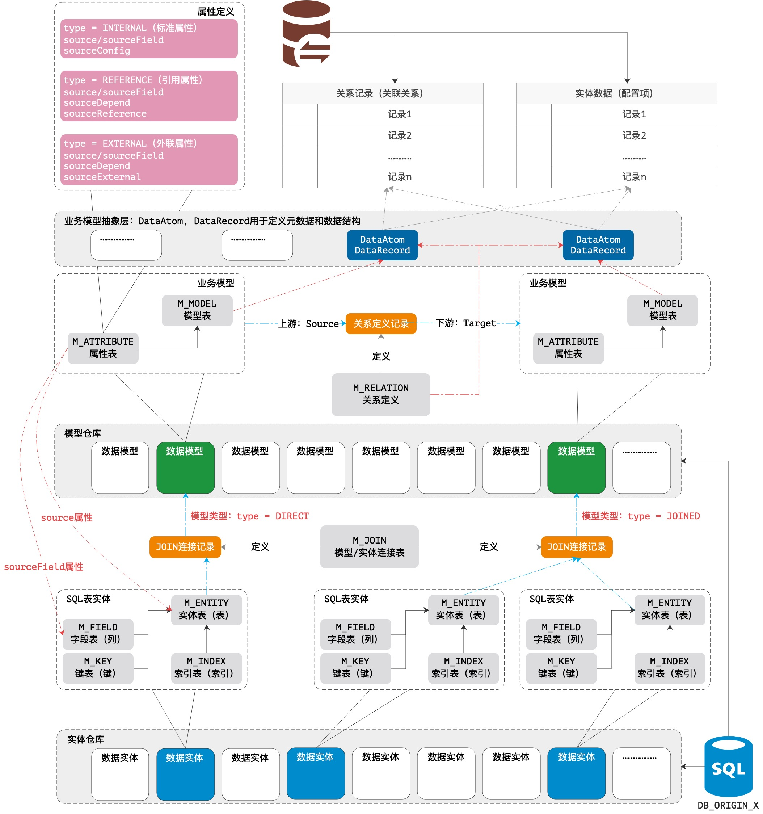

# 建模管理

## 1. 基本说明

&ensp;&ensp;&ensp;&ensp;动态建模部分的整体结构由`vertx-pin/zero-atom`项目实现，主要用于不同项目中的动态建模，模型本身元数据存储在元数据库仓库中（MySQL），整个建模部分包含三部分：

1. 实体层
    1. `M_ENTITY`：对应SQL中的数据表。
    2. `M_FIELD`：对应SQL中的数据表上的字段。
    3. `M_KEY`：对应SQL中的键约束`FOREIGN、UNIQUE、PRIMARY`。
    4. `M_INDEX`：对应SQL中的索引信息。
2. 模型层
    1. `M_MODEL`：对应业务模型（可多表、可单表）。
    2. `M_ATTRIBUTE`：对应业务模型上的属性，会关联到实体层中的表和字段。
3. 关联层
    1. `M_JOIN`：实体和模型的关联层，存储了元数据信息。
    2. `M_RELATION`：模型和模型的关联层，存储了模型之间的关系信息。

## 2. 整体结构图

